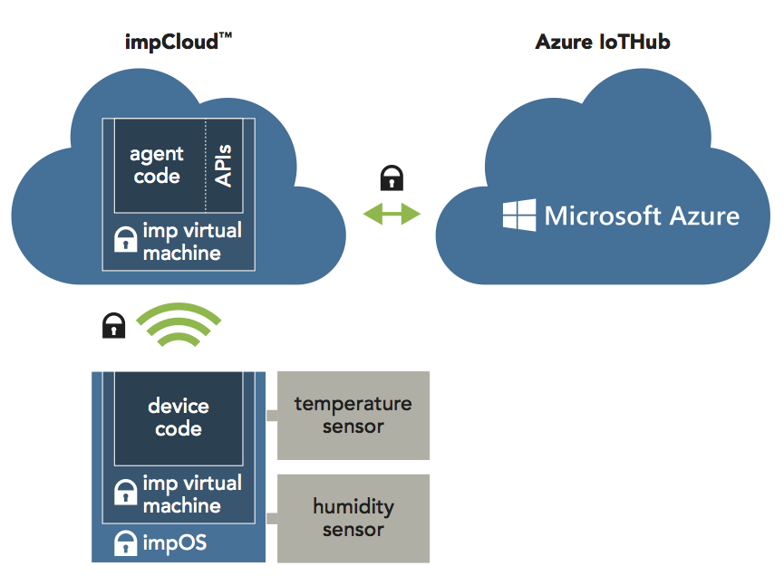
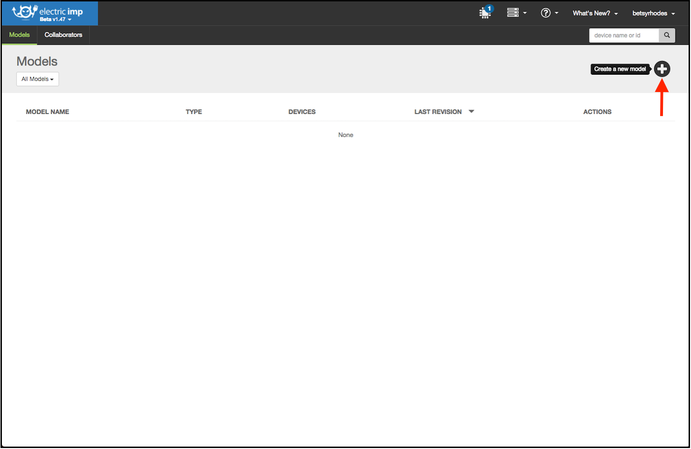
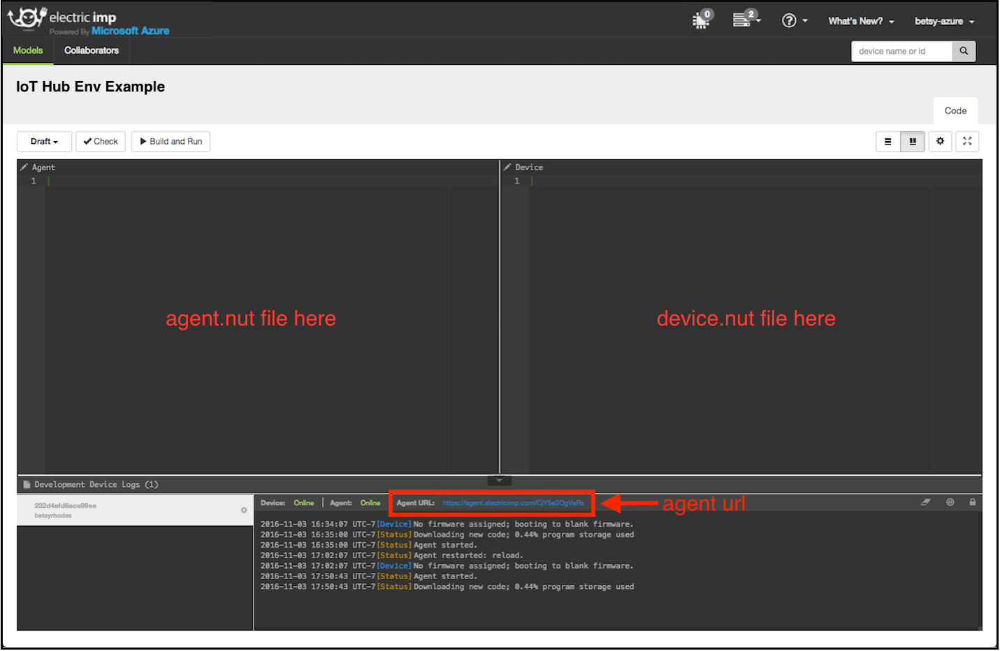
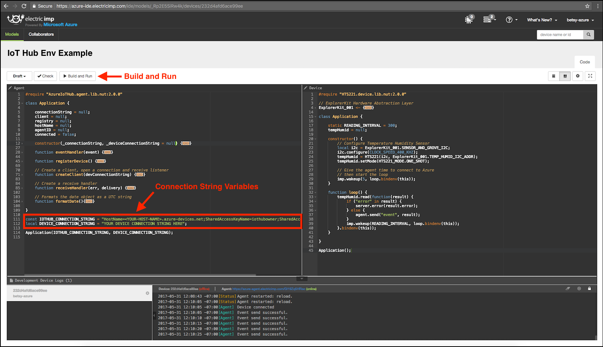

# Connect Electric Imp to Azure IoT Hub

In this tutorial, you begin by learning the basics of working with Electric Imp. We will use Electric Imp Libraries to seamlessly connect your impExplorer Kit data to the cloud by using [Azure IoT Hub](https://docs.microsoft.com/en-us/azure/iot-hub/iot-hub-what-is-iot-hub). This tutorial implements manual device registration through the IoTHub UI. For automatic device registration, please see this [tutorial](../IoT%20Hub%20Env%20Example%20-%20Auto%20Register). 

## What you do

* BlinkUp your impExplorer Kit
* Create an IoT Hub
* Register your device in IoT Hub
* Run a sample application using the Electric Imp IDE to send sensor data to IoT Hub

The impExplorer Kit provides a set of sensors and peripherals which are ready to use. This project will take readings from the onboard temperature/humidity sensor and send the readings to Azure IoT Hub.

## What you learn

* How to BlinkUp your device
* How to use the Electric Imp IDE
* How to create an Azure IoT Hub
* How to register your device with your IoT Hub and get your connection string
* How to collect sensor data from the onboard temperature/humidity sensor
* How to send sensor data to your IoT Hub

## What you need

1. Your WiFi Network *name* and *password*
2. A computer with a web browser
3. Smartphone with the Electric Imp app ([iOS](https://itunes.apple.com/us/app/electric-imp/id547133856) or [Andriod](https://play.google.com/store/apps/details?id=com.electricimp.electricimp))
4. A free [Electric Imp Azure Account](https://azure-ide.electricimp.com/login)
5. A [Microsoft Azure Account](https://azure.microsoft.com/en-us/resources/videos/sign-up-for-microsoft-azure/)
6. An [Electric Imp Explorer Kit](https://store.electricimp.com/collections/featured-products/products/impexplorer-developer-kit?variant=31118866130)
7. USB power source or 3 AA batteries

## Set up your Electric Imp device with BlinkUp

First we will need to assemble the impExplorer Kit. The kit comes with the following components:

1. The imp001 card, which has a WiFi radio and microcontroller which drives all the logic for the board
2. The impExplorer Kit into which the card is plugged
3. A USB cable to power the impExplorer Kit

### Hardware Setup

 - Plug the imp001 card into the breakout board slot
 - Power up your Imp with the USB cable or 3 AA batteries
 - The imp001 should now have power and be blinking amber/red

Assembled it should look like this:

### Electric Imp BlinkUp

Use the Electric Imp mobile app to BlinkUp your device

1. Log into your Electric Imp account
2. Enter your WiFi credentials
3. Follow the instructions in the app to BlinkUp your device

If you have any issues getting started with your Electric Imp account or device, see [the full getting started guide](https://electricimp.com/docs/gettingstarted/quickstartguide/).

### How Electric Imp's connectivity platform works

The Electric Imp IoT Connectivity Platform has two main components — the impDevice and the impCloud. The impDevice runs the device code, which in this use case consolidates the data gathered by the temperature/humidity sensor. Each device is paired one-to-one with a "virtual twin" — or, as we call it, an agent — in the impCloud. The device sends this data to its agent, which runs agent code. In this example the agent code communicates with the Azure IoT Hub cloud. Here's a broad overview of this flow:

The Electric Imp IDE provides all the tools you need to write and deploy the software (to the device and agent) that will control your imp-enabled connected product. The IDE runs in a desktop web browser and communicates between the device and cloud solutions.

If you'd like a quick overview of the IDE features please visit the Electric Imp [Dev Center](https://electricimp.com/docs/gettingstarted/explorer/ide/).

### Electric Imp IDE / Code

1. Open your web browser and log in to the [Electric Imp IDE](https://azure-ide.electricimp.com/login)
2. Click the + button to create a new model

3. In the pop up name your code model, select your device and click **Create Model**
4. Find the logs window (near the bottom of the IDE) and locate agent url. It will look something like this: https://agent.electricimp.com/szPc0sLfAqlu
5. Make a note of the agent id - last part of the agent URL (ie "szPc0sLfAqlu"). We will use this in the next steps as a unique identifier when registering our device in Azure IoT Hub.

## Create an IoT Hub resource

1. In the [Azure portal](https://portal.azure.com/), click **New > Internet of Things > IoT Hub**

2. In the **IoT hub** pane, enter the following information for your IoT hub:

 - **Name**: This is the name for your IoT hub. If the name you enter is valid, a green check mark appears.

 - **Pricing and scale tier**: Select the free F1 tier. This option is sufficient for this demo. See [pricing and scale tier](https://azure.microsoft.com/pricing/details/iot-hub/).

 - **Resource group**: Create a resource group to host the IoT hub or use an existing one. See [Using resource groups to manage your Azure resources](https://docs.microsoft.com/en-us/azure/azure-resource-manager/resource-group-portal).

 - **Location**: Select the location closest to where the IoT hub was created.

 - **Pin the dashboard**: Check this option for easy access to your IoT hub from the dashboard.

3. Click **Create**. It could take a few minutes for your IoT hub to be created. You can see progress in the **Notifications** pane.

4. Once your IoT hub is created, click it from the dashboard. Make a note of the **Hostname**, and then click **Shared access policies**.

5. In the Shared access policies pane, click the iothubowner policy, and then copy and make a note of the Connection string of your IoT hub. You will need to enter this value in the code later.  For more information, see Control access to IoT Hub.

## Register a device in IoT hub

In this example we will register the device via the Azure portal. Please note that devices can also be registered programatically by using the Electric Imp library's AzureIoTHub.Registry methods.

1. In the [Azure portal](https://portal.azure.com/), open your IoT hub.

2. Click **Device Explorer**.

3. In the Device Explorer pane, click **Add** to add a device to your IoT hub. Enter:

 - **Device ID**: The ID of the new device. For this example we will use the Agent ID (see step 5 of the Electric Imp IDE / Code section)
 - **Authentication Type**: Select **Symmetric Key**.
 - **Auto Generate Keys**: Check this field.
 - **Connect device to IoT Hub**: Click **Enable**.

 

4. Click Save.

5. After the device is created, open the device in the **Device Explorer** pane.

6. Make a note of the primary key of the connection string. We will use this when running our sample application.

## Run a sample application on Electric Imp

1. Reopen the [Electric Imp IDE](https://azure-ide.electricimp.com/login) and navigate to the model you created.
2. Copy and Paste the [agent code](./IoTHubEnvExample_ManualRegister.agent.nut) from github into the left side of the IDE in the agent window
3. Copy and Paste the [device code](./IoTHubEnvExample_ManualRegister.device.nut) from github into the right side of the IDE in the device window

4. In the agent code look for the **IOTHUB_CONNECTION_STRING** and **DEVICE_CONNECTION_STRING** variables. Copy and paste your connection string from **Create an IoT Hub resource** step 5 in to the **IOTHUB_CONNECTION_STRING** variable. Copy and paste your device connection string from **Register a device in IoT hub** step 6 in to the **DEVICE_CONNECTION_STRING** variable.
5. Hit Build and Run to save and launch the code

## Next Steps

You’ve run a sample application to collect sensor data and send it to your IoT hub.

To continue getting started with IoT Hub and to explore other IoT scenarios, see:

- [Manage cloud device messaging with iothub-explorer](https://docs.microsoft.com/en-us/azure/iot-hub/iot-hub-explorer-cloud-device-messaging)
- [Save IoT Hub messages to Azure data storage](https://docs.microsoft.com/en-us/azure/iot-hub/iot-hub-store-data-in-azure-table-storage)
- [Use Power BI to visualize real-time sensor data from Azure IoT Hub](https://docs.microsoft.com/en-us/azure/iot-hub/iot-hub-live-data-visualization-in-power-bi)
- [Use Azure Web Apps to visualize real-time sensor data from Azure IoT Hub](https://docs.microsoft.com/en-us/azure/iot-hub/iot-hub-live-data-visualization-in-web-apps)
- [Weather forecast using the sensor data from your IoT hub in Azure Machine Learning](https://docs.microsoft.com/en-us/azure/iot-hub/iot-hub-weather-forecast-machine-learning)
- [Device management with iothub-explorer](https://docs.microsoft.com/en-us/azure/iot-hub/iot-hub-device-management-iothub-explorer)
- [Remote monitoring and notifications with ​​Logic ​​Apps](https://docs.microsoft.com/en-us/azure/iot-hub/iot-hub-monitoring-notifications-with-azure-logic-apps)
