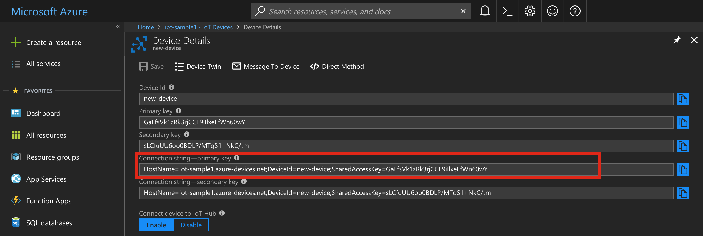

# Azure IoT Hub Examples

This document describes the example application provided with the [AzureIoTHub library](../README.md). 

There are three examples for all the features available with Azure IoT Hub: Messages(TODO), Twins(TODO), Direct Methods(TODO).

The first example (Messages(TODO)) means manual device registration, while the others mean programmatical registration.

## Azure IoT Hub how to's

### Create An IoT Hub Resource

1. In the [Azure portal](https://portal.azure.com/), click **New > Internet of Things > IoT Hub**:

2. In the **IoT hub** pane, enter the following information for your IoT hub:

 - **Name** This is the name for your IoT hub. If the name you enter is valid, a green check mark appears.

 - **Pricing and scale tier** Select the free F1 tier. This option is sufficient for this demo. See [pricing and scale tier](https://azure.microsoft.com/pricing/details/iot-hub/).

 - **Resource group** Create a resource group to host the IoT hub or use an existing one. See [Using resource groups to manage your Azure resources](https://docs.microsoft.com/en-us/azure/azure-resource-manager/resource-group-portal).

 - **Location** Select the location closest to where the IoT hub was created.

 - **Pin the dashboard** Check this option for easy access to your IoT hub from the dashboard.

3. Click **Create**. It could take a few minutes for your IoT hub to be created. You can see progress in the **Notifications** pane:

4. Once your IoT hub is created, click it from the dashboard. Click on **Overview**. Make a note of the **Hostname**, and then click **Shared access policies**:

5. In the **Shared access policies** pane, click the **iothubowner** policy, and then copy and make a note of the **Connection string--primary key** of your IoT hub. You will need to enter this value in the code later:

### Manually Register A Device In IoT Hub

We will register the device via the Azure portal. Please note that devices can also be registered programmatically by using the Electric Imp AzureIoTHub library’s *AzureIoTHub.Registry* class methods.

1. In the [Azure portal](https://portal.azure.com/), open your IoT hub.

2. Click **IoT Devices** in the **DEVICE MANAGEMENT** section.

3. Click **Add** to add a device to your IoT hub. Enter:

 - **Device ID** The ID of the new device. For this example we will use the Agent ID (see step 5 of the Electric Imp IDE / Code section)
 - **Authentication Type** Select **Symmetric Key**.
 - **Auto Generate Keys** Check this field.
 - **Connect device to IoT Hub** Click **Enable**.

 

4. Click **Save**.

5. After the device is created, open the device in the **IoT Devices** pane.

6. Make a note of the **Connection string--primary key**. We will use this when running our sample application:

### Send A Message To The Device

1. In your IoT hub, open the device you want to send a message to.

 

2. Click **Message To Device**. Type some message in the **Message Body** field. Add some properties, if needed.

 

3. Click **Send Message** to send the message.

### Retrieve/Update Twin's Document

1. In your IoT hub, open the device you want to get the twin's document of.

 

2. Click **Device Twin**. Here you can see and update the twin's document.

 

3. If you want to update desired properties, make changes and click **Save**. For example:

 

**Note**: Use **Refresh** to refresh the document and get the latest changes.

### Call A Direct Method

1. In your IoT hub, open the device you want to send a message to.

 

2. Click **Direct Method**. Input some Method Name. Add some payload, if needed. Payload is always a valid JSON or nothing.

 

3. Click **Invoke Method**.

## Example 1: Messages

## Example 2: Twins

## Example 3: Direct Methods
