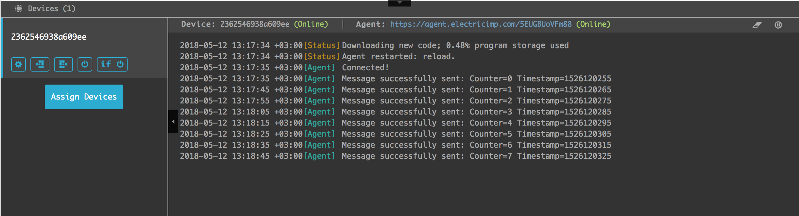
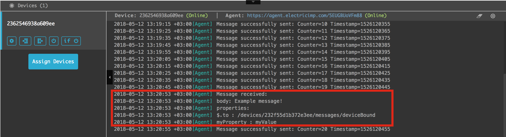
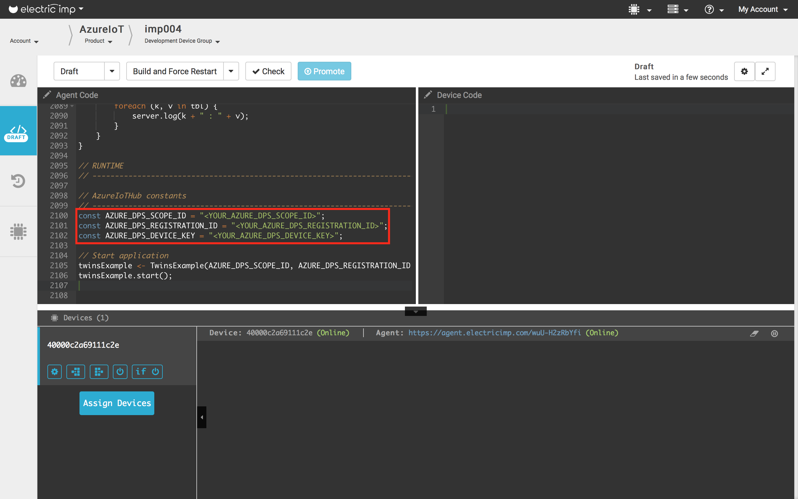
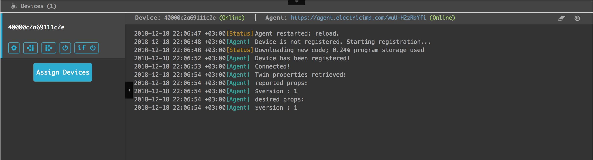

# Azure IoT Hub Examples #

This document describes the example applications provided with the [AzureIoTHub library](../README.md).

## Messages example ##

The example:
- connects the device to Azure IoT Hub using the provided Device Connection String
- enables cloud-to-device messages functionality
- logs all messages received from the cloud
- periodically (every 10 seconds) sends a message to the cloud. The message contains an integer value and the current timestamp. The value increases by 1 with every sending, it restarts from 1 every time when the example is restarted.

Source code: [Messages.agent.nut](./Messages.agent.nut)

See [Messages Example Setup and Run](#messages-example-setup-and-run).

## Twins Example ##

This example:
- automatically registers the device (if not registered yet) using the provided Registry Connection String
- connects the device to Azure IoT Hub using an automatically obtained Device Connection String
- enables Twin functionality
- retrieves the Twin's properties (both - Desired and Reported) from the cloud and logs them
- logs all Desired properties received from the cloud, reads the value of the Desired property "test" and sends it back to the cloud as a Reported property

Source code: [Twins.agent.nut](./Twins.agent.nut)

See [Twins Example Setup and Run](#twins-example-setup-and-run).

## Direct Methods Example ##

This example:
- automatically registers the device (if not registered yet) using the provided Registry Connection String
- connects the device to Azure IoT Hub using an automatically obtained Device Connection String
- enables Direct Methods functionality
- logs all Direct Method calls received from the cloud, always responds success

Source code: [DirectMethods.agent.nut](./DirectMethods.agent.nut)

See [Direct Methods Example Setup and Run](#direct-methods-example-setup-and-run).

## Example Setup and Run ##

### Messages Example Setup and Run ###

1. [Login To Azure Portal](#login-to-azure-portal)

2. [Create IoT Hub Resource](#create-iot-hub-resource) (if not created yet)

3. [Manually Register Device And Obtain Device Connection String](#manually-register-device-and-obtain-device-connection-string)

4. [Set up your Imp device](https://developer.electricimp.com/gettingstarted)

5. In the [Electric Imp's IDE](https://ide.electricimp.com) create new Product and Development Device Group.

6. Assign a device to the newly created Device Group.

7. Copy the [Messages example source code](./Messages.agent.nut) and paste it into the IDE as the agent code.

8. Set *AZURE_DEVICE_CONN_STRING* constant in the agent example code to the **Device Connection String** you obtained and saved earlier.
The value should look like `HostName=<Host Name>;DeviceId=<Device Name>;SharedAccessKey=<Device Key>`.

9. Click **Build and Force Restart**.

10. Check from the logs in the IDE that messages are successfully sent from the device (periodically)

11. [Send Message To Device](#send-message-to-device) from the Azure Portal and check from the logs in the IDE that the message is received successfully

### Twins Example Setup and Run ###

1. [Login To Azure Portal](#login-to-azure-portal)

2. [Create IoT Hub Resource](#create-iot-hub-resource) (if not created yet)

3. [Obtain Registry Connection String](#obtain-registry-connection-string)

4. [Set up your Imp device](https://developer.electricimp.com/gettingstarted)

5. In the [Electric Imp's IDE](https://ide.electricimp.com) create new Product and Development Device Group.

6. Assign a device to the newly created Device Group.

7. Copy the [Twins example source code](./Twins.agent.nut) and paste it into the IDE as the agent code.

8. Set *AZURE_REGISTRY_CONN_STRING* constant in the agent example code to the **Registry Connection String** you obtained and saved earlier.
The value should look like `HostName=<Host Name>;SharedAccessKeyName=<Key Name>;SharedAccessKey=<SAS Key>`.

9. Click **Build and Force Restart**.

10. Check from the logs in the IDE that the device is registered, connected, and twin's properties are retrieved

11. [Update Twin Document](#retrieveupdate-twin-document) from the Azure Portal: add or change, if already exists, the desired property "test". Then check from the logs in the IDE that the desired properties are received and the reported properties are updated.

12. In the Azure Portal, refresh the twin's document and check that the reported properties now contain the "test" property you set in the previous step.

### Direct Methods Example Setup and Run ###

1. [Login To Azure Portal](#login-to-azure-portal)

2. [Create IoT Hub Resource](#create-iot-hub-resource) (if not created yet)

3. [Obtain Registry Connection String](#obtain-registry-connection-string)

4. [Set up your Imp device](https://developer.electricimp.com/gettingstarted)

5. In the [Electric Imp's IDE](https://ide.electricimp.com) create new Product and Development Device Group.

6. Assign a device to the newly created Device Group.

7. Copy the [Direct Methods example source code](./DirectMethods.agent.nut) and paste it into the IDE as the agent code.

8. Set *AZURE_REGISTRY_CONN_STRING* constant in the agent example code to the **Registry Connection String** you obtained and saved earlier.
The value should look like `HostName=<Host Name>;SharedAccessKeyName=<Key Name>;SharedAccessKey=<SAS Key>`.

9. Click **Build and Force Restart**.

10. Check from the logs in the IDE that the device is registered and connected

11. [Call Direct Method](#call-direct-method) from the Azure Portal and check from the logs in the IDE that the call is received

12. In the Azure Portal, check that the result of the call is received.

## Azure IoT Hub How To ##

### Login To Azure Portal ###

Login to [Azure portal](https://portal.azure.com/).
If you are not registered, create an account with subscription (free subscription is enough for testing purposes).

### Create IoT Hub Resource ###

1. In the [Azure portal](https://portal.azure.com/), click **New > Internet of Things > IoT Hub**:

2. In the **IoT hub** pane, enter the following information for your IoT hub:

 - **Name** This is the name for your IoT hub. If the name you enter is valid, a green check mark appears.

 - **Pricing and scale tier** Select the free F1 tier. This option is sufficient for this demo. See [pricing and scale tier](https://azure.microsoft.com/pricing/details/iot-hub/).

 - **Resource group** Create a resource group to host the IoT hub or use an existing one. See [Using resource groups to manage your Azure resources](https://docs.microsoft.com/en-us/azure/azure-resource-manager/resource-group-portal).

 - **Location** Select the location closest to where the IoT hub was created.

 - **Pin the dashboard** Check this option for easy access to your IoT hub from the dashboard.

3. Click **Create**. It could take a few minutes for your IoT hub to be created. You can see progress in the **Notifications** pane:

### Obtain Registry Connection String ###

1. In the [Azure portal](https://portal.azure.com/), open your IoT hub.

2. Click **Shared access policies**.

3. In the **Shared access policies** pane, click the **iothubowner** policy, and then make a note of the **Connection string--primary key** of your IoT hub - this is the **Registry connection string** which may be needed to setup and run your application.

### Manually Register Device And Obtain Device Connection String ###

1. In the [Azure portal](https://portal.azure.com/), open your IoT hub.

2. Click **IoT Devices** in the **DEVICE MANAGEMENT** section.

3. Click **Add** to add a device to your IoT hub. Enter:

 - **Device ID** The ID of the new device. You can type here some arbitrary name.
 - **Authentication Type** Select **Symmetric Key**.
 - **Auto Generate Keys** Check this field.
 - **Connect device to IoT Hub** Click **Enable**.

 

4. Click **Save**.

5. After the device is created, open the device in the **IoT Devices** pane.

6. Make a note of the **Connection string--primary key** - this is the **Device connection string** which may be needed to setup and run your application.

### Send Message To Device ###

1. In the [Azure portal](https://portal.azure.com/), open your IoT hub.

2. In the IoT hub, open the device you want to send a message to.

3. Click **Message To Device**.

 

4. Type some message in the **Message Body** field. Add some properties, if needed.

 

5. Click **Send Message** to send the message.

### Retrieve/Update Twin Document ###

1. In the [Azure portal](https://portal.azure.com/), open your IoT hub.

2. In the IoT hub, open the device you want to get the twin's document of.

3. Click **Device Twin**.

 

4. Here you can see and update the twin's document.

 

5. If you want to update the desired properties, make changes and click **Save**. For example:

 

**Note**: Use **Refresh** button to refresh the document and get the latest changes.

### Call Direct Method ###

1. In the [Azure portal](https://portal.azure.com/), open your IoT hub.

2. In the IoT hub, open the device you want to call a direct method of.

 

3. Click **Direct Method**. Input some Method Name. Add some payload, if needed. Payload should be a valid JSON or nothing.

 

4. Click **Invoke Method**.

